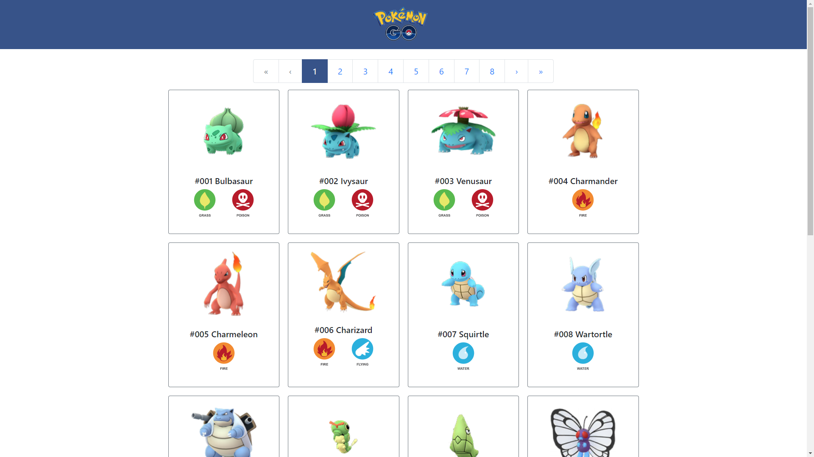
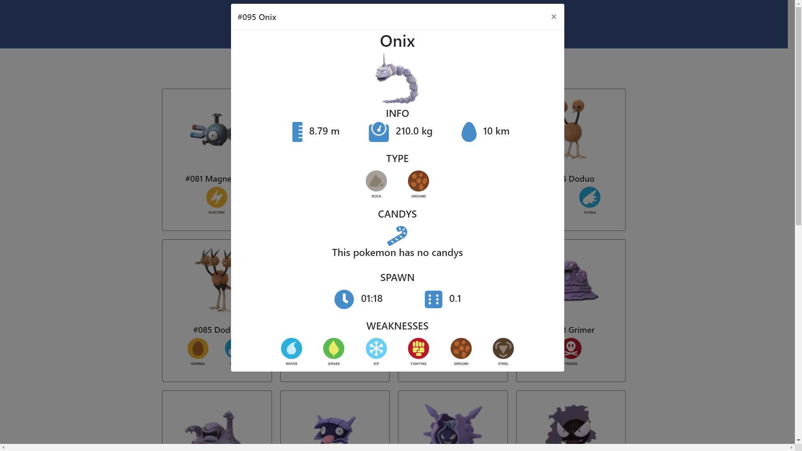

# Pokemons - React_Redux App - Recruitment task

## 1. General info
The application was created using the React.js and Redux. The project has features such as fetch information from the API, render them in list, pagination, modal with details about Pokemon, routing and tests. 
## 2. Setup
 1. Clone or download repository
 ```
 git clone https://github.com/JedrzejZygadlo/Pokedex-ReactJS_recruitment_task.git
 cd Pokedex-ReactJS_recruitment_task
 ```
 2. Install modules
 ```
 npm install
 ```
 3. Start JSON Server (port 8000)
 ```
 npm run server
 ```
 4. Start client server (port 3000)
 ```
 npm start 
 ```
 5. Run Simple Test
 ```
 npm run test
 ```
 
## 3. Technologies
* React.js
* Redux
* react-router
* redux-thunk
* react-redux
* axios
* Reactstrap
* Bootstrap
* create-react-app
* Font Awesome
* EsLint, Prettier

## 4. Screenshots



